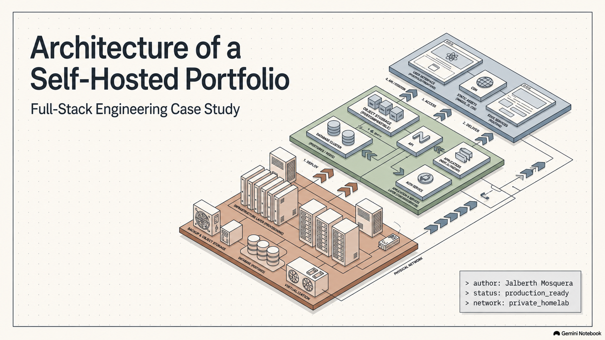
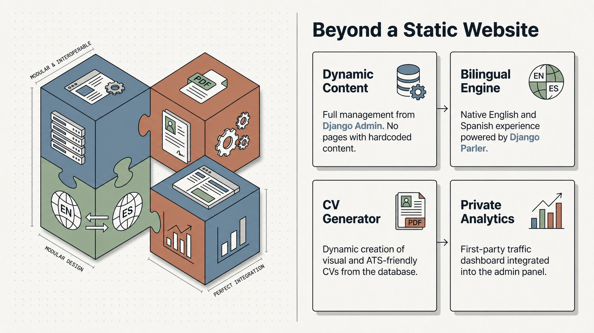
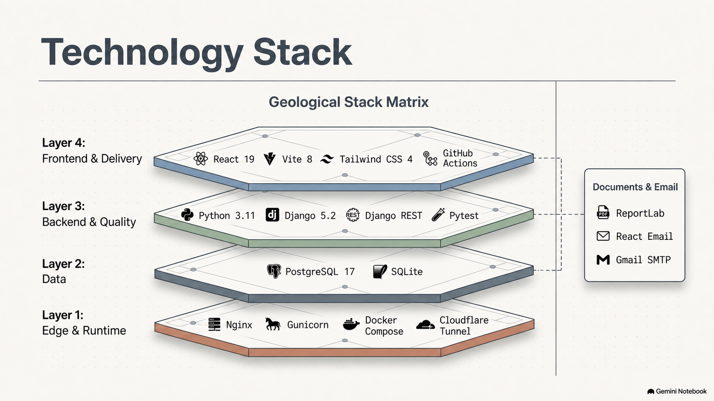
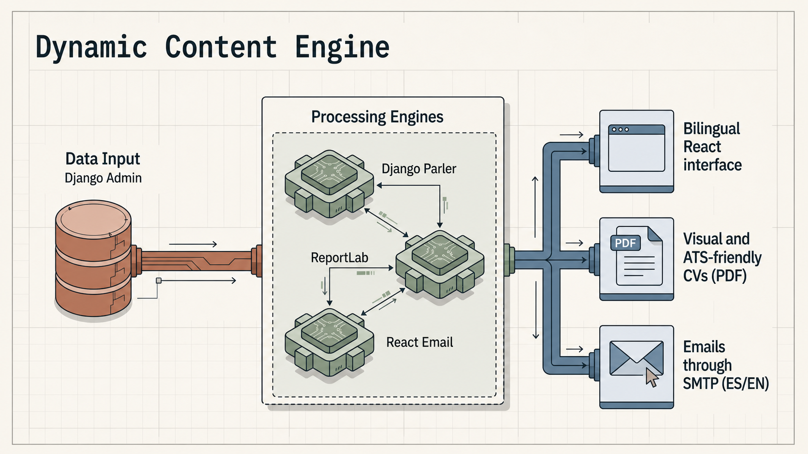
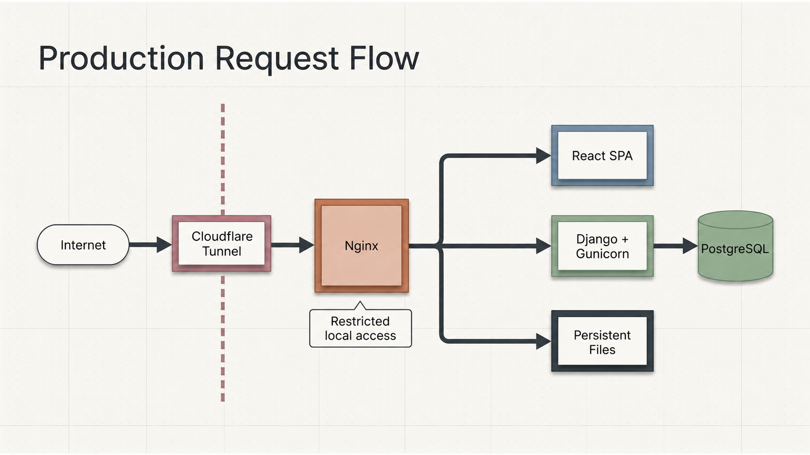
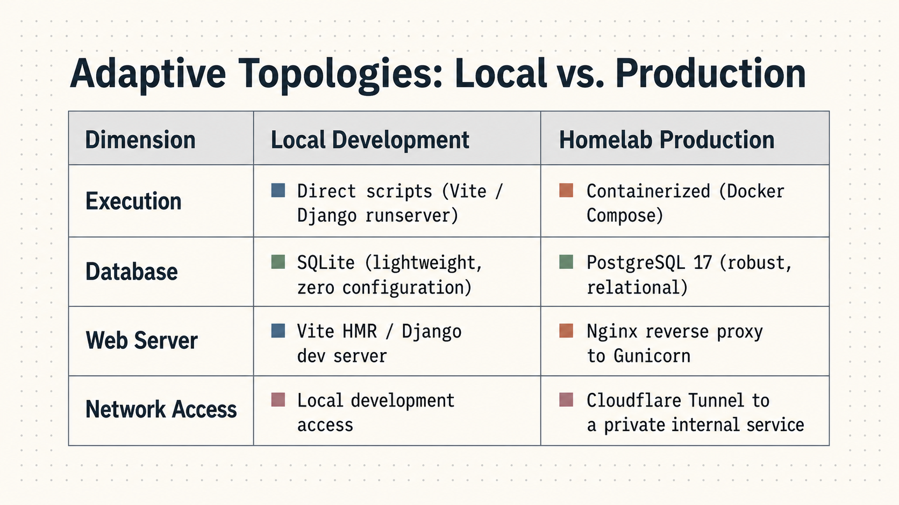
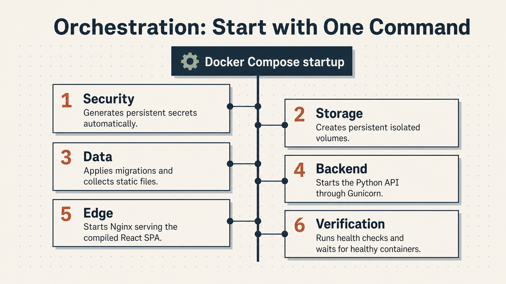
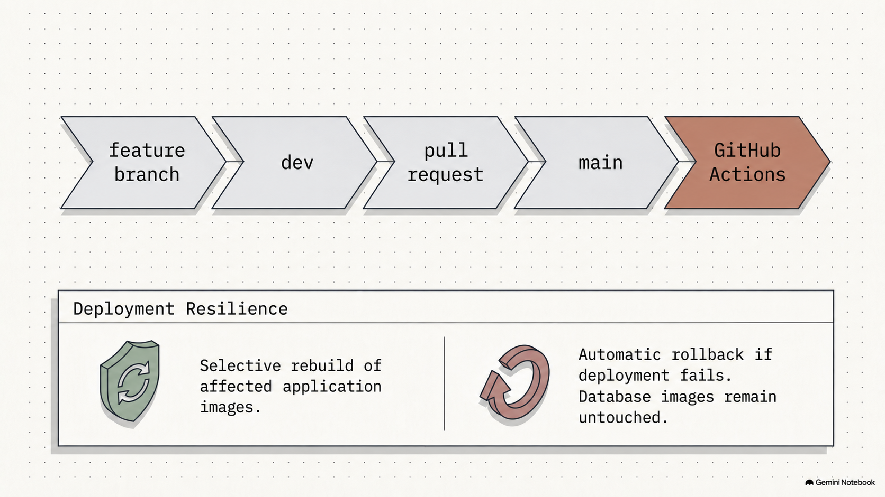
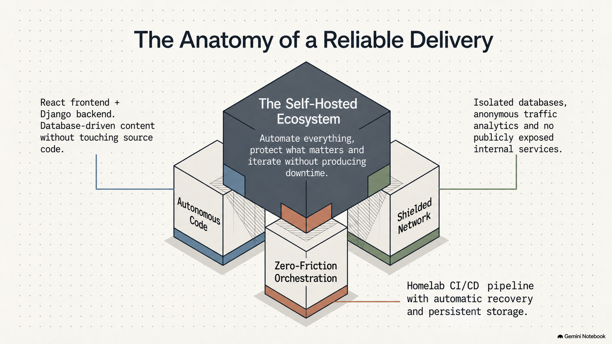
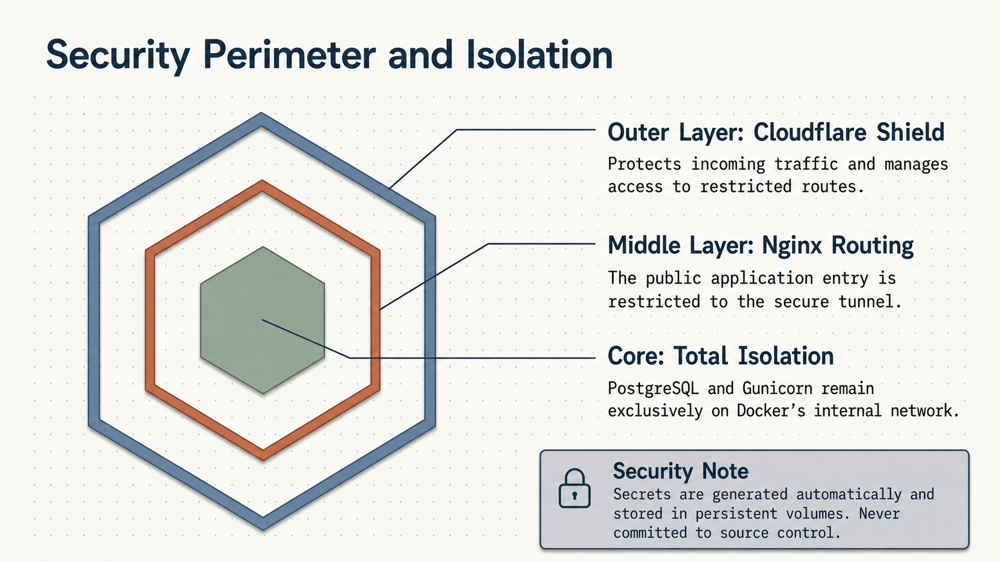

# 🚀 Jalberth Mosquera — Professional Self-Hosted Portfolio

[](README.md)

> [!IMPORTANT]
> **This portfolio is deployed in a private homelab.** Production traffic reaches the application entry point through Cloudflare Tunnel. Django and PostgreSQL remain isolated inside Docker's private network.

A bilingual, database-driven portfolio for showcasing real client projects, generating dynamic CVs and receiving contact inquiries. It combines a React frontend with a Django REST API and a production-ready Docker Compose stack designed for self-hosting.

## 📚 Documentation index

| Topic | What you will find |
| --- | --- |
| [🏗️ Architecture](docs/architecture.md) | Request flow, containers, security boundaries and major design decisions |
| [🗄️ Database](docs/database.md) | PostgreSQL/SQLite strategy, domain models, relationships, persistence and backups |
| [📁 Project structure](docs/project-structure.md) | Repository map and responsibilities of the main folders |
| [🔌 API](docs/api.md) | Public endpoints, language negotiation, admin and API documentation |
| [💻 Local development](docs/development.md) | Python and Node setup, migrations, tests, linting and email templates |
| [🏠 Homelab deployment](docs/production-deployment.md) | Cloudflare Tunnel, Docker Compose, health checks, updates, rollback and backups |

## 🏗️ System architecture

The solution separates presentation, business logic, persistence and delivery. Nginx serves the React SPA and routes backend requests; Gunicorn runs Django; PostgreSQL stores application data; Docker volumes preserve uploaded files, static assets and secrets.



### Beyond a static website

Content is managed through Django Admin, the complete experience is bilingual, CVs are generated from database records and private analytics avoid dependence on external tracking platforms.



## ✨ Highlights

- 🌍 Complete English and Spanish experience with Django Parler and frontend translations.
- 🧩 Portfolio content managed from Django Admin instead of hardcoded pages.
- 🖼️ Featured projects, galleries, technology details, lessons learned and case studies.
- 📄 Dynamic professional and visual CV generation from database content.
- ✉️ Gmail SMTP notifications and bilingual contact confirmations styled with React Email.
- 📊 Protected first-party analytics.
- 🐳 Production startup through Docker Compose.
- 🏠 Automated delivery through GitHub Actions and a self-hosted runner.
- ↩️ Application-image recovery when a deployment fails.

## 🧰 Technology stack

| Layer | Technologies |
| --- | --- |
| Frontend | React 19, Vite 8, Tailwind CSS 4, Axios, React Router, Sileo |
| Backend | Python 3.11, Django 5.2, Django REST Framework, Django Parler |
| Data | PostgreSQL 17 in production, SQLite for local development |
| Documents & email | ReportLab, React Email, Gmail SMTP |
| Edge & runtime | Nginx, Gunicorn, Docker Compose, Cloudflare Tunnel |
| Quality & delivery | Pytest, ESLint, GitHub Actions, self-hosted runner |



## ⚙️ Dynamic content

Django Admin is the data source. Django Parler resolves translations, ReportLab builds both CV formats and React Email prepares bilingual notifications and confirmations.



## 🧭 Production request flow

Traffic crosses Cloudflare Tunnel and reaches the application's single entry point. From there, React is served, requests are routed to Django and persistent files are delivered. The database remains on the internal network.



### Local development versus production

Local development prioritizes fast feedback and debugging; production uses containers, isolated services, PostgreSQL and a reverse proxy.



## ⚡ Run the production stack

Requirements: Git, Docker Engine and Docker Compose v2.

```bash
git clone https://github.com/jalmosquera/portfolio.git
cd portfolio
docker compose up -d
```

The first startup:

1. 🔐 Generates persistent secrets.
2. 🗄️ Creates isolated volumes for data and files.
3. 🔄 Applies migrations and collects static assets.
4. 🦄 Starts Django through Gunicorn.
5. 🌐 Starts Nginx with the compiled React application.
6. ❤️ Waits for healthy services.



Verify the stack with:

```bash
docker compose ps
```

Continue with [🏠 Homelab deployment](docs/production-deployment.md) for the complete setup.

## 🧑‍💻 Local development

```bash
# Terminal 1 — backend
source .venv/bin/activate
python backend/manage.py migrate
python backend/manage.py runserver

# Terminal 2 — frontend
cd frontend
npm install
npm run dev
```

Read [💻 Local development](docs/development.md) before configuring email, running tests or regenerating templates.

## 🚢 Delivery workflow

```text
feature branch → dev → pull request → main → GitHub Actions → homelab
```

Every change reaching `main` is validated by GitHub Actions before the self-hosted runner performs the deployment. Only affected application images are rebuilt; a failed deployment restores previous images without automatically reversing database migrations.





## 🔐 Security

- Never commit `.env`, application passwords or generated secrets.
- Public application access is restricted to the secure tunnel.
- PostgreSQL and Gunicorn remain inside Docker's private network.
- Protecting the administration area with Cloudflare Access is strongly recommended.
- Never remove volumes unless permanent data deletion is intentional.



## 📄 License and ownership

This repository contains Jalberth Mosquera's personal portfolio and project presentation material. Review its licensing status before reusing branding, content, photographs or client-related assets.
