# 🚀 Jalberth Mosquera — Portfolio profesional autoalojado

[](README.en.md)

> [!IMPORTANT]
> **Este portfolio está desplegado en un homelab privado.** El tráfico de producción llega mediante Cloudflare Tunnel al punto de entrada de la aplicación. Django y PostgreSQL permanecen aislados dentro de la red privada de Docker.

Portfolio bilingüe y administrado desde base de datos para presentar proyectos reales, generar CV dinámicos y recibir consultas de contacto. Combina un frontend React, una API Django REST y una infraestructura Docker Compose preparada para autoalojamiento.

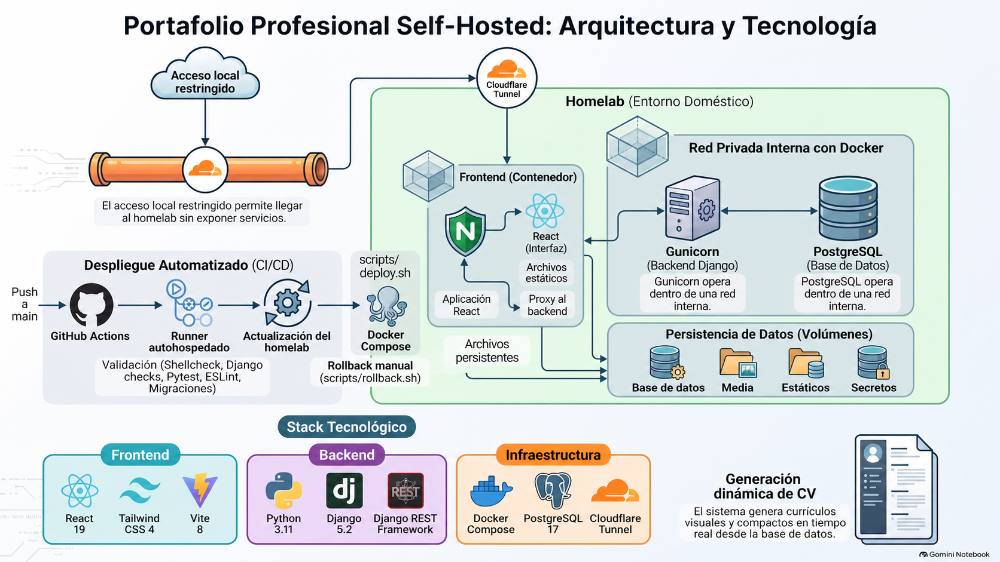

## 📚 Índice de documentación

| Tema | Contenido |
| --- | --- |
| [🏗️ Arquitectura](docs/architecture.md) | Flujo de peticiones, contenedores, límites de seguridad y decisiones principales |
| [🗄️ Base de datos](docs/database.md) | PostgreSQL/SQLite, modelos, relaciones, persistencia y copias de seguridad |
| [📁 Estructura del proyecto](docs/project-structure.md) | Mapa del repositorio y responsabilidad de cada carpeta |
| [🔌 API](docs/api.md) | Endpoints públicos, idiomas, administración y documentación OpenAPI |
| [💻 Desarrollo local](docs/development.md) | Python, Node, migraciones, pruebas, lint y plantillas de correo |
| [🏠 Despliegue en homelab](docs/production-deployment.md) | Cloudflare Tunnel, Docker Compose, healthchecks, actualizaciones y rollback |

> [!NOTE]
> Los documentos técnicos especializados se mantienen en inglés como fuente única de verdad. Este README es la entrada principal en español.

## 🏗️ Arquitectura del sistema

La solución separa presentación, lógica de negocio, persistencia y entrega. Nginx sirve la SPA de React y enruta las solicitudes del backend; Gunicorn ejecuta Django; PostgreSQL conserva los datos y los volúmenes de Docker protegen los archivos y secretos persistentes.

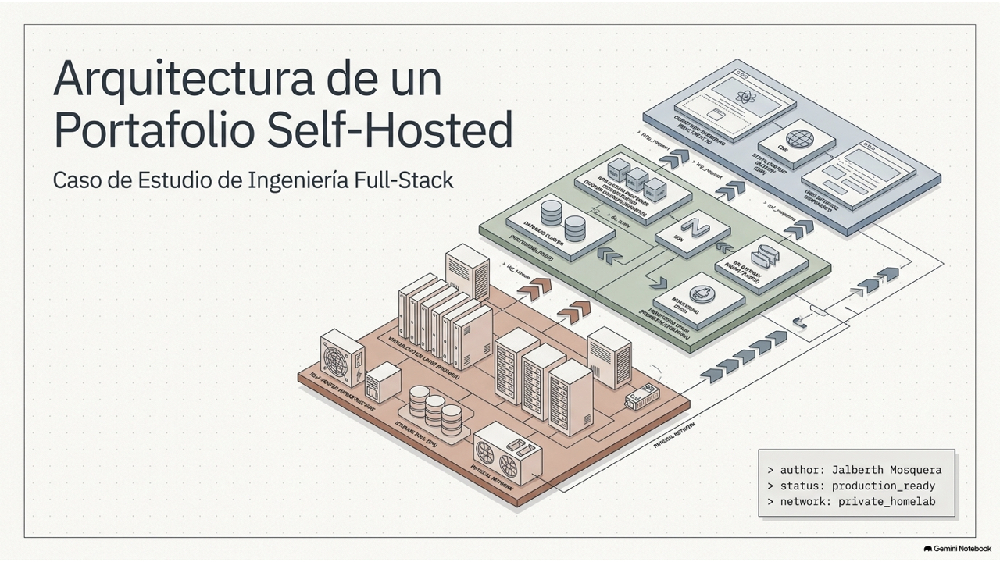

### Más que un sitio estático

El contenido se administra desde Django Admin, la experiencia completa funciona en español e inglés, los CV se generan desde la base de datos y la analítica privada evita depender de plataformas externas.

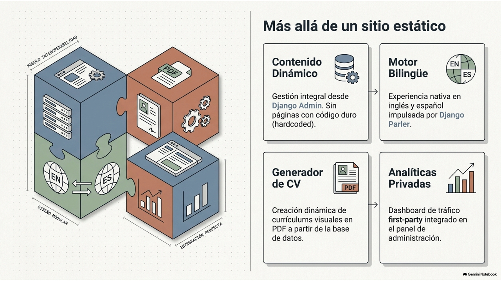

## ✨ Características principales

- 🌍 Experiencia completa en español e inglés mediante Django Parler y traducciones del frontend.
- 🧩 Contenido administrable desde Django Admin en lugar de páginas hardcodeadas.
- 🖼️ Proyectos destacados, galerías, tecnologías y casos de estudio.
- 📄 CV dinámico en formato profesional o visual generado desde la base de datos.
- ✉️ Notificaciones SMTP y confirmaciones bilingües diseñadas con React Email.
- 📊 Analítica first-party privada y protegida.
- 🐳 Inicio de producción con Docker Compose.
- 🏠 Despliegue automatizado mediante GitHub Actions y un runner autoalojado.
- ↩️ Recuperación de imágenes de aplicación anteriores cuando un despliegue falla.

## 🧰 Stack tecnológico

| Capa | Tecnologías |
| --- | --- |
| Frontend | React 19, Vite 8, Tailwind CSS 4, Axios, React Router, Sileo |
| Backend | Python 3.11, Django 5.2, Django REST Framework, Django Parler |
| Datos | PostgreSQL 17 en producción y SQLite para desarrollo local |
| Documentos y correo | ReportLab, React Email, Gmail SMTP |
| Ejecución | Nginx, Gunicorn, Docker Compose, Cloudflare Tunnel |
| Calidad y entrega | Pytest, ESLint, GitHub Actions, runner autoalojado |

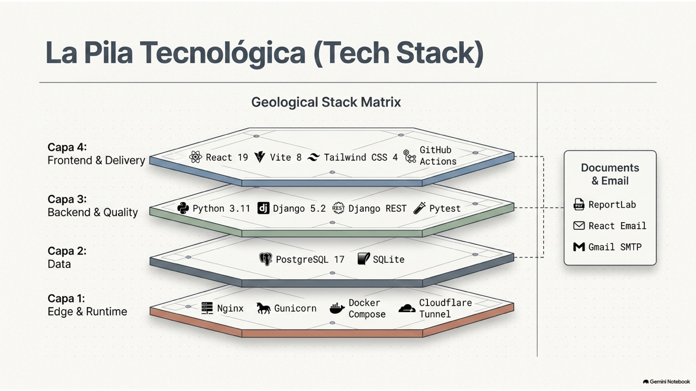

## ⚙️ Contenido dinámico

Django Admin es la fuente de datos. Django Parler resuelve las traducciones, ReportLab construye los dos formatos de CV y React Email prepara las notificaciones y confirmaciones bilingües.

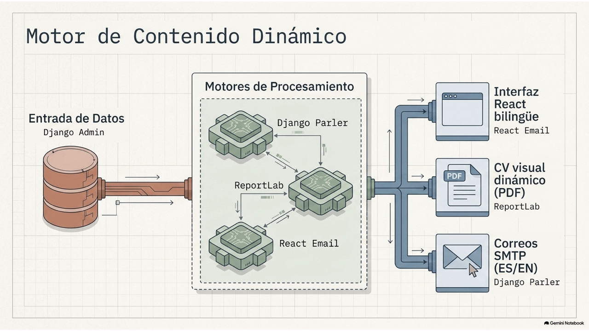

## 🧭 Flujo de producción

El tráfico atraviesa Cloudflare Tunnel y llega al único punto de entrada de la aplicación. Desde allí se sirve React, se enrutan las solicitudes hacia Django y se entregan los archivos persistentes. La base de datos permanece en la red interna.

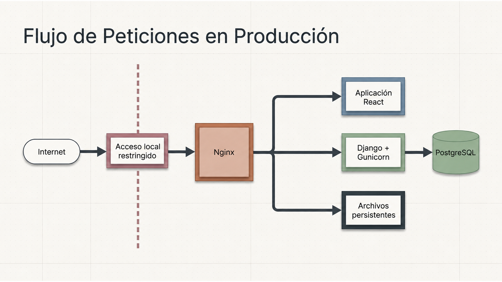

### Desarrollo local frente a producción

El entorno local prioriza rapidez y depuración; producción utiliza contenedores, servicios aislados, PostgreSQL y un proxy inverso.

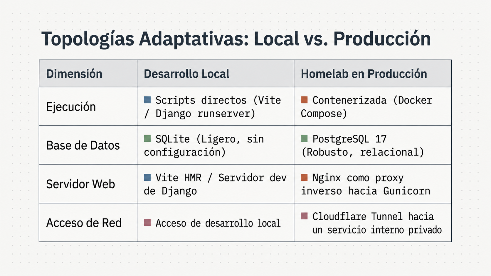

## ⚡ Iniciar producción

Requisitos: Git, Docker Engine y Docker Compose v2.

```bash
git clone https://github.com/jalmosquera/portfolio.git
cd portfolio
docker compose up -d
```

El primer inicio:

1. 🔐 Genera secretos persistentes.
2. 🗄️ Crea volúmenes aislados para datos y archivos.
3. 🔄 Aplica las migraciones y recopila los estáticos.
4. 🦄 Inicia Django mediante Gunicorn.
5. 🌐 Inicia Nginx con la aplicación React compilada.
6. ❤️ Espera a que los servicios estén saludables.

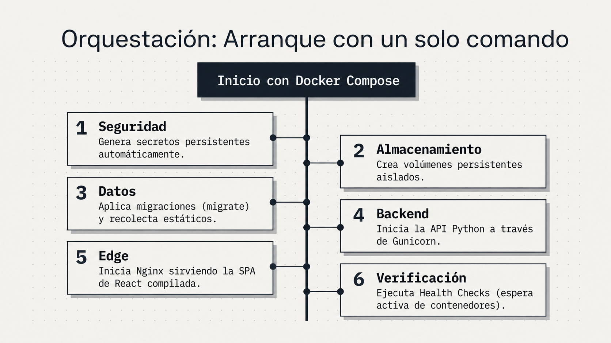

Verificá el estado con:

```bash
docker compose ps
```

La configuración completa se encuentra en [🏠 Despliegue en homelab](docs/production-deployment.md).

## 🧑‍💻 Desarrollo local

```bash
# Terminal 1 — backend
source .venv/bin/activate
python backend/manage.py migrate
python backend/manage.py runserver

# Terminal 2 — frontend
cd frontend
npm install
npm run dev
```

Consultá [💻 Desarrollo local](docs/development.md) para configurar el correo, ejecutar las pruebas y regenerar las plantillas.

## 🚢 Flujo de entrega

```text
rama de feature → dev → pull request → main → GitHub Actions → homelab
```

Cuando `main` recibe cambios, GitHub Actions valida el proyecto y el runner del homelab ejecuta el despliegue. Solo se reconstruyen las imágenes afectadas; si el proceso falla, se restauran las imágenes anteriores sin revertir automáticamente la base de datos.

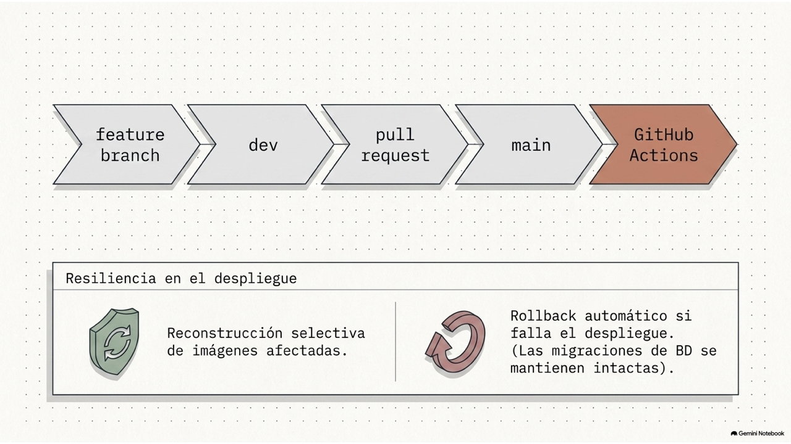

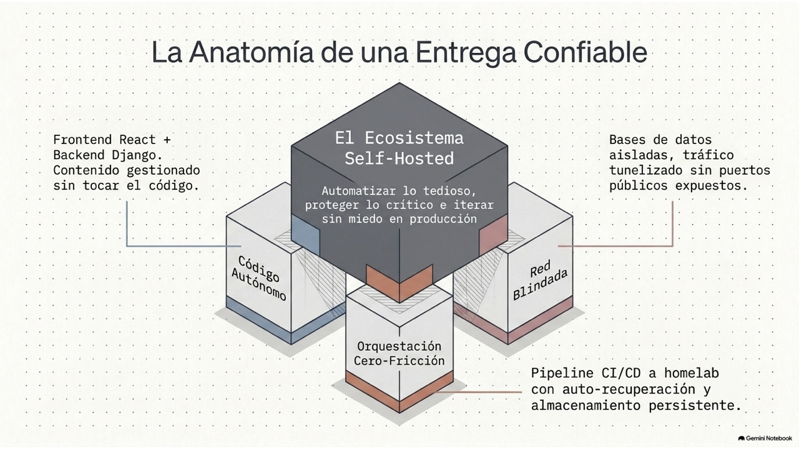

## 🔐 Seguridad

- Nunca subas `.env`, contraseñas de aplicación ni secretos generados.
- El acceso público de la aplicación está restringido al túnel seguro.
- PostgreSQL y Gunicorn permanecen dentro de la red privada de Docker.
- Se recomienda proteger la administración mediante Cloudflare Access.
- No elimines los volúmenes salvo que quieras borrar permanentemente los datos.

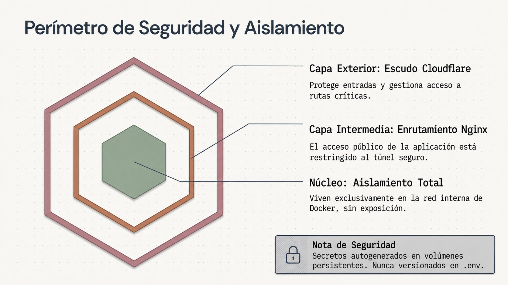

## 📄 Licencia y propiedad

Este repositorio contiene el portfolio personal y material de presentación de proyectos de Jalberth Mosquera. Revisá el estado de la licencia antes de reutilizar su identidad visual, contenido, fotografías o recursos relacionados con clientes.
