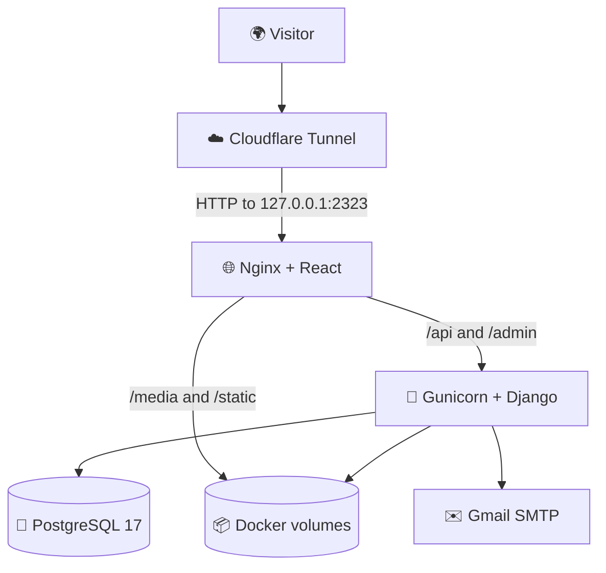
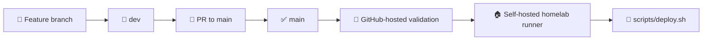

# 🏗️ System architecture

[← Back to documentation index](../README.md)

## 🏠 Self-hosting first

The production architecture is designed for a private homelab. Cloudflare Tunnel provides the public route without opening inbound router ports. The only host socket published by Docker is Nginx on `127.0.0.1:2323`.

## 🧱 Runtime services

| Service | Responsibility | Publicly exposed? |
| --- | --- | --- |
| `secrets-init` | Generates persistent Django and database secrets on first startup | No; exits after initialization |
| `db` | Stores portfolio, CV, contact and analytics data in PostgreSQL 17 | No |
| `backend` | Runs migrations, collects static files and serves Django through Gunicorn | No |
| `frontend` | Serves the React build, proxies Django paths and exposes health checks through Nginx | Loopback only |

All services share the `internal` Docker network. Dependency health conditions ensure PostgreSQL is ready before Django, and Django is healthy before Nginx starts serving traffic.

## 🧭 Routing responsibilities

| Path | Owner |
| --- | --- |
| `/` and client-side routes | React SPA |
| `/api/*` | Django REST Framework |
| `/api/swagger/`, `/api/redoc/` | DRF Spectacular |
| `/admin/*` | Django Admin |
| `/static/*` | Nginx from the persistent static volume |
| `/media/*` | Nginx from the persistent media volume |
| `/healthz` | Nginx health endpoint |

The frontend uses relative `/api` URLs. Browser traffic therefore remains same-origin in production and Nginx is the single entry point.

## 🧩 Application architecture

### Frontend

- **Pages** compose route-level screens.
- **Components** hold reusable layout and feature UI.
- **Context and i18n** coordinate the active language.
- **`lib/api`** centralizes Axios communication.
- **`lib/config`** centralizes frontend URLs and route builders.

### Backend

The Django project follows domain-oriented apps such as `projects`, `resume`, `contact` and `analytics`. Each public domain exposes DRF routes under `apps/<domain>/api/`, while Django Admin remains the private content-management interface.

Translated data uses Django Parler. Project-related translations live in localized content models, allowing the same domain object to serve English and Spanish representations.

## 🔐 Trust boundaries

- Cloudflare terminates the public connection and forwards traffic through the tunnel.
- Nginx is the only application-facing container.
- Gunicorn trusts the proxy scheme through `X-Forwarded-Proto`.
- PostgreSQL credentials and Django's secret key are files inside a persistent secrets volume.
- SMTP credentials are supplied through the server's ignored `.env` file.
- Containers use read-only filesystems where practical and `no-new-privileges`.

## 🚢 Delivery architecture

The deploy script compares revisions and rebuilds only the affected application images. Before replacement, current frontend and backend images receive a `rollback` tag. Failed deployment commands trigger log collection and an automatic image restore.

For operational commands, read [🏠 Production deployment](production-deployment.md).
