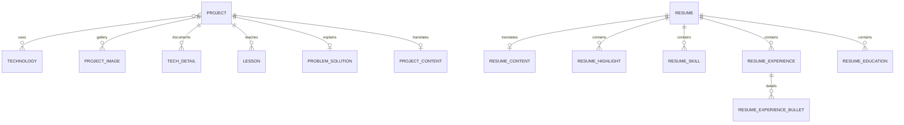

# 🗄️ Database and persistence

[← Back to documentation index](../README.md)

## 🐘 Database strategy

- **Production:** PostgreSQL 17 in the `db` container.
- **Local development:** SQLite when `DB_NAME` is not configured.
- **Schema management:** Django migrations.
- **Content management:** Django Admin.
- **Translations:** Django Parler with English and Spanish content.

The PostgreSQL container is internal-only. Its data lives in the `portfolio_postgres_data` named volume and survives container replacement.

## 🧩 Domain model map



## 📦 Main data areas

| Domain | Important models | Purpose |
| --- | --- | --- |
| Portfolio | `Project`, `ProjectContent`, `Technologies` | Project cards, descriptions, visibility and featured state |
| Case studies | `ProjectImage`, `TechDetail`, `Lesson`, `ProblemSolution` | Gallery and detailed project narrative |
| About | `About` | Singleton bilingual About Me section |
| CV | `Resume` and ordered resume item models | Database-driven visual and compact PDF generation |
| Contact | `ContactInquiry` | Recruiter/company messages, workflow status and email delivery audit |
| Analytics | `SiteVisitCounter` | Atomic private visit count displayed in Django Admin |

## 🌍 Translation model

The application supports `en` and `es`. Django Parler stores translated fields separately from language-neutral fields.

Examples:

- A project slug, visibility and image are shared.
- Its title and descriptions can vary by language.
- Resume contact information is shared.
- Resume headline, profile, experience descriptions and education content are translated.

This separation avoids duplicating complete entities just to provide another language.

## 💾 Persistent volumes

| Volume | Contains | Must be backed up? |
| --- | --- | --- |
| `portfolio_postgres_data` | PostgreSQL cluster | ✅ Yes |
| `portfolio_media_data` | Project images, portraits and uploaded media | ✅ Yes |
| `portfolio_static_data` | Collected Django static files | ♻️ Reproducible |
| `portfolio_secrets_data` | Django secret key and database password | ✅ Yes |

> [!WARNING]
> PostgreSQL and the secrets volume form a recovery pair. Deleting only `portfolio_secrets_data` generates a new password that does not match the existing PostgreSQL database.

## 🔄 Migrations

Local development:

```bash
python backend/manage.py makemigrations --check --dry-run
python backend/manage.py migrate
python backend/manage.py showmigrations
```

Production migrations run from the backend container entrypoint before Gunicorn starts.

Schema migrations are not automatically reversed during an application rollback. This is intentional: automatically dropping or changing database structures can destroy production data.

## 🛟 Backup principles

At minimum, back up:

1. 🐘 PostgreSQL using `pg_dump`.
2. 🖼️ The media volume.
3. 🔐 The secrets volume.

Test restoration periodically. A backup that has never been restored is only an assumption.

Continue with [🏠 Production deployment](production-deployment.md#backups) for the operational context.
